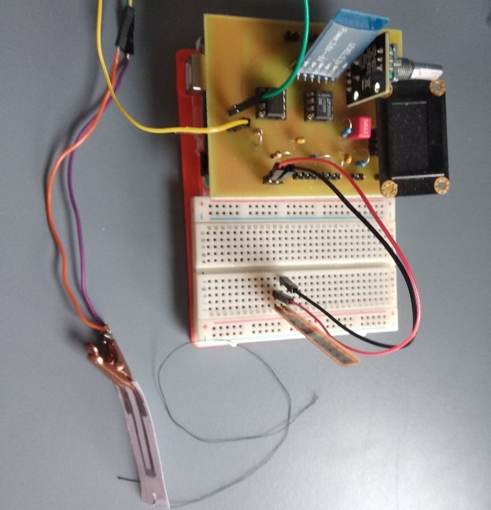


**Projet Capteur**

SOMMAIRE

[Introduction	](#_aqfiiiz3mat1)

[Circuit électronique	2](#_85kghymnccqe)

[Etude des filtres	3](#_3wv6rcoxo2u0)

[Modélisation du capteur:	5](#_od7riktkldgj)

[Schema complet:	6](#_dfu786f6gm2l)

[KICAD	6](#_9s9i8k258f05)

[Photo du circuit	11](#_kr2nya7ldd2s)

[Le programme Arduino	12](#_101d9m39fwqz)

[Application bluetooth	12](#_bzfua36c38m9)

[Banc de test	12](#_r0kbzpm251z9)

[Datasheet	12](#_eai4omgrnxa8)

[Discussions	12](#_o2hx32m0ftjm)

[Ameliorations	13](#_7aa4jqu1zgj3)

[Remerciements	13](#_hgrpjs9usncb)

# Introduction

Dans le cadre de l'UF "du capteur au banc de test" en 4ème année Génie Physique à l'INSA Toulouse, nous devions réaliser un capteur low-tech à base de graphite. Notre projet se base sur ce papier scientifique dont le but était de mesurer la résistance d’un capteur low-tech à base de graphite et déterminer son évolution au cours du temps en fonction de sa déformation. 

Ce répertoire comporte l’ensemble des étapes de réalisation.  

# Circuit électronique 

Le capteur que nous souhaitons utiliser pour ce projet est alimenté en 5V a une résistance de quelques dizaines megohms qui rend une mesure directe d’un courant de l’ordre 1 nA assez difficile avec les outils conventionnels. Ainsi il est nécessaire de passer par un circuit amplificateur. Pour cela nous avons utilisé un circuit de l'amplificateur transimpédance à  2 étages. 

Nous avons également utilisé 3 filtres pour réduire le bruit au maximum. Le schéma est présenté ci-dessous:

• R5 en entrée protège l'ampli opérationnel contre les décharges électrostatiques (il sera remplacé par notre capteur graphite)

• C1 avec R1 forme un filtre pour le bruit en courant 

• R2 pour une adaptation du calibre 

• C4 avec R3 forme un filtre actif 

• C2 avec R6 forme le filtre de sortie 

• C3 filtre le bruit d'alimentation (pour l'Arduino ce condensateur ne sera pas nécessaire)  

Le signal de la sortie en fonction de la résistance R5 s'écrit:

## Etude des filtres

Si nous ne mettons aucun filtres, nous obtiendrons la réponse suivante:

**Visualisation mesure filtre R1C1**

**Visualisation mesure filtre R3C4**

**Visualisation mesure filtre R6C2**

 

## Modélisation du capteur: 

## Schema complet: 

# KICAD

Nous avons utilisé le logiciel KICAD pour la réalisation de notre PCB. 

 

**Schématique et empreinte des composants que nous avons dû modéliser:** 

**Notre PCB:**

## **Photo du circuit**

# Le programme Arduino
Le programme Arduino permet de lire les valeurs de tension du capteur graphite et du capteur flex et de les envoyer par bluetooth. Il permet également d'ajuster le gain en recevant une valeur de l'application. 
# Application bluetooth

L'application à été développée avec le logiciel MIT App Inventor. Elle est dotée de fonctionnalités suivantes:

- Affichage de la résistance du capteur et du flex sensor
- Modification du gain du circuit
- Affichage de la datasheet

# Banc de test

L’objectif de ce banc de test est de déterminer la variation relative de résistance de notre capteur en fonction de la déformation appliquée. À l'aide d'une imprimante 3D, nous avons créé notre bande de test. Ensuite nous avons utilisé notre banc de test pour mesurer la résistance en fonction de la déformation.

D'après nos tests nous constatons que notre capteur donne des résultats acceptables.

# Datasheet
Pour la datasheet nous avons été inspirés par Texas Industries. 
# Discussions 

Ce projet nous a sensibilisé sur les technologies low-tech. Ces technologies écoresponsables et moins coûteuses peuvent devenir une alternative aux méthodes conventionnelles. Nous faire prendre conscience de cette démarche dès la 4ème année du cursus d’ingénieur nous aidera dans nos futurs métiers.  
# Ameliorations 
Lors de nos tests, nous avons remarqué que les capteurs n'étaient pas durables. Il serait intéressant d'effectuer des tests avec d’autres types de papier. 

# Remerciements
Nous souhaitons remercier le département de Génie Physique de l’INSA de Toulouse de nous avoir offert la chance de réaliser ce projet complet d’un capteur: de son développement jusqu’à sa caractérisation. Nous tenons tout particulièrement à remercier Jérémie Grisolia et Cathy Crouzet qui nous ont apporté leur aide pour mener à bien ce projet. 
